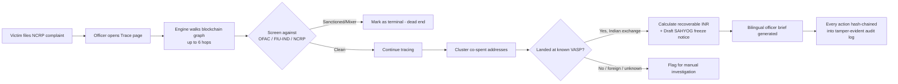

## CRYPTO FRAUD ATTRIBUTION PORTAL

**A tool that helps Indian cybercrime officers trace a scammer's crypto wallet back to a real exchange — and draft the legal freeze notice — in minutes instead of days.**

Built for **Ministry of Home Affairs / I4C, Problem Statement ID-26183**: *"Real-time identification of fraud-linked cryptocurrency exchanges from victim-reported wallet addresses through automated blockchain analytics."*

---

## 1. The problem, in plain words

A victim gets scammed and sends crypto to a wallet address. That address is just a random string of letters and numbers — on its own, it tells an investigating officer nothing. Meanwhile:

- Crypto moves **fast**. Stolen funds often reach an exchange within an hour.
- Exchanges can only be legally asked to freeze funds if police send a **correctly worded, legally grounded notice**, naming the *exact* wallet cluster.
- After roughly **48 hours**, the money is usually cashed out or bridged away — gone.
- Manually tracing a wallet across multiple "hops" (wallet → wallet → wallet → exchange) by hand, then drafting a formal freeze notice, takes far longer than 48 hours.

**GARUDA closes that gap.** An officer pastes in a wallet address, and the system does the tracing, the exchange identification, the risk scoring, and drafts the freeze notice — automatically.

---

## 2. A real-life scenario — how it's actually used

> **9:14 AM** — A woman in Pune reports on the National Cyber Crime Reporting Portal (NCRP) that she was tricked into sending ₹2,10,000 in USDT to a wallet address after a fake "task-based investment" WhatsApp scheme. NCRP complaint `NCRP-2026-1001` is logged.
>
> **9:20 AM** — The assigned cyber cell officer opens **GARUDA**, goes to the **Trace** page, and pastes in the suspect wallet address plus the complaint ID.
>
> **9:20:03 AM** — GARUDA walks the transaction graph outward from that wallet (up to 6 hops), screening each address against sanctions lists (OFAC, FIU-IND) and against every other NCRP complaint on file — in case this is a repeat scammer.
>
> **9:20:05 AM** — The trace finds the money moved through two intermediate "burner" wallets and landed at a deposit cluster belonging to a real Indian exchange — **CoinDCX**. GARUDA flags this as the highest-value freeze target and shows the recoverable amount in ₹.
>
> **9:21 AM** — The officer clicks **Generate Notice**. GARUDA auto-drafts a formal **SAHYOG freeze request**, addressed to CoinDCX's compliance nodal officer, citing **Section 91 CrPC**, **Section 17 PMLA**, and the IT Act — ready to sign and send.
>
> **9:22 AM** — GARUDA also generates a plain-language **officer brief** (in English or Hindi) summarizing the case, so the officer can act immediately without reading raw transaction data.
>
> **9:23 AM** — The freeze notice is sent to CoinDCX. Because it arrived within the first hour — well inside the exchange's stated 6-hour freeze SLA — the funds are frozen before the scammer can withdraw them.
>
> **Later** — Everything the officer did in GARUDA (the trace, the notice, every action) is recorded in a tamper-evident log, so if this case goes to court, the evidence trail can't be silently altered.

This is the entire point of the project: **turn a multi-day manual investigation into a 10-minute guided workflow**, so freeze notices go out before the 48-hour window closes.

---

## 3. What GARUDA actually does — the pipeline

| Step | What happens | Where in the app |
|---|---|---|
| 1. **Complaint intake** | Victim's wallet + NCRP case ID entered | `Cases` page |
| 2. **Sanctions/repeat-offender screening** | Every address checked against OFAC, FIU-IND, and other NCRP complaints | `Intel` page + engine |
| 3. **Graph tracing** | Follows outbound transaction hops (max 6, with a cycle guard so it can't loop forever) | `Trace` page |
| 4. **Address clustering** | Groups wallets that were spent together (co-spend analysis) — a strong signal they're controlled by the same person/operator | Trace engine |
| 5. **Mixer / bridge detection** | Flags if funds passed through a mixer (treated as a dead end) or a cross-chain bridge (tracing continues on the other side) | Trace engine |
| 6. **Exchange (VASP) identification** | Matches the final wallet cluster to a real, known exchange — WazirX, CoinDCX, Binance, etc. | VASP registry |
| 7. **Risk scoring & recoverable value** | Calculates a 0–100 risk score and the ₹ amount realistically recoverable at an Indian exchange | Trace engine |
| 8. **Freeze notice + officer brief + audit log** | Auto-drafts the legal freeze notice, a bilingual case summary, and appends a SHA-256-hash-chained audit entry | `Dossier`, `Evidence` pages |

---

## 4. Tech stack

| Layer | Technology | Why |
|---|---|---|
| **Frontend framework** | [TanStack Start](https://tanstack.com/start) (React 19, file-based routing, server functions) | Fast, modern full-stack React with routes as files |
| **UI components** | Radix UI + Tailwind CSS v4 | Accessible, consistent, quick to build with |
| **State management** | Zustand | Simple in-browser state for the current case/trace |
| **Database** | Neon (serverless PostgreSQL), queried via Kysely | Cloud Postgres that scales to zero; PGlite runs a local copy automatically so development matches production |
| **Authentication** | Better Auth | Handles officer sign-in and sessions |
| **Live blockchain data** | Blockstream public API (Bitcoin) | Pulls real, live transaction hops instead of only simulated demo data |
| **Build tooling** | Vite + Nitro | Fast dev server and build, deployable as serverless functions |
| **Hosting** | Vercel | Deployment target (Vercel Build Output format) |
| **Testing** | Node's built-in test runner + Playwright | Automated checks and browser-level screenshot verification |

---

## 5. Architecture at a glance



---

## 6. Project structure

```
├── src/
│   ├── routes/          → the 8 app pages (Home, Cases, Trace, Dossier,
│   │                       Evidence, VASPs, Intel, Playbook)
│   ├── lib/garuda/       → the actual engine:
│   │     engine.ts        core trace + clustering logic
│   │     registry.ts      known VASPs, sanctions, bridges/mixers
│   │     live.ts          live Bitcoin API calls (Blockstream)
│   │     notices.ts       auto-generates legal freeze notices
│   │     ai-brief.ts      bilingual officer briefing generator
│   │     i18n.ts          English/Hindi translations
│   └── components/       → reusable UI (cards, badges, graph view, etc.)
├── migrations/           → database schema (auth tables etc.)
├── server/               → server-side middleware
├── attachments/          → earlier Python prototype of the same pipeline
│                           (kept for reference — the live app is the
│                            TypeScript engine above)
└── screenshots/          → UI preview captures
```

---

## 7. Why this matters (impact, in numbers)

- **Manual tracing**: hours to days per case, requires a trained blockchain analyst.
- **GARUDA**: seconds to trace, minutes to a sendable freeze notice.
- Every hour saved matters — most stolen crypto is cashed out or bridged within **48 hours**, and Indian exchanges can freeze funds fast (as little as a **6-hour SLA**) *if* they receive a correctly targeted, legally worded notice in time.

---

## 8. Current status

- ✅ Core tracing, clustering, mixer/bridge detection, VASP attribution — working
- ✅ Bilingual officer briefs and legal freeze notice generation — working
- ✅ Tamper-evident audit logging — working
- ✅ Live Bitcoin data via Blockstream API — working
- 🔶 Live Ethereum data — placeholder, pending live-environment testing
- 🔶 Direct SAHYOG/NCRP outbound integration — documented for future work
- 🔶 Broader VASP address coverage beyond demo data — planned expansion

---

## 9. Running it locally

```bash
npm install
npm run dev
```

This starts the app at `http://localhost:8080`, using a local PGlite database that mirrors the production Neon schema automatically — no manual database setup needed.

---

## 10. FAQ

**Is this connected to real exchanges?**
It uses real, publicly known exchange identities (WazirX, CoinDCX, Binance, etc.) for demonstration and drafts real, legally-grounded notices — but sending a notice to an actual exchange would be a manual step taken by an authorized officer, not something the app does automatically.

**Where does the trace data come from?**
Bitcoin traces can pull live data from a public blockchain explorer. Where live data isn't available (e.g., in a sandboxed environment), the system uses realistic simulated transaction data so the full pipeline can still be demonstrated end-to-end.

**Why are there Python files in `attachments/`?**
That was an earlier prototype of the same fraud-tracing logic, built before the current web app. It's kept in the repo for reference but is not part of the running application.
